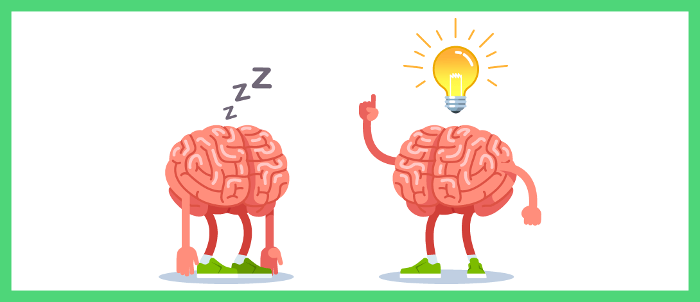

Hello! I'm **Lina Al-mashaikh**.I’m 24 years old and I have bachelors degree in software engineering . 

Today i want to tell you what i think about **Growth Mindset**

**What is a growth mindset?**

A growth mindset believes that abilities can be developed through perseverance and effort .
the concept is a love of learning.
A fixed mindset sees that success comes from  intelligence and talent and there's no need for further development or effort.

I think we should have ability to use a growth mindset that is can make us more successful without a huge stress.
-
Now I want to give you some differences between fixed and a growth mindset when they're facing :

||Fixed Minset | Groth Mindset |
| :------------- | :----------: | -----------: |
|Challenges |Avoid  |Embraces |
|Obstacles  |Loses focus |Persists |
|Criticism  |Ignores |Learns from |

For me i can do these reminders that keep me in **a growing mindset**:
1. Solve problems by thinking out of the box.
2. Never stop asking and learning.
3. Start to learn new hobby.

Thank you for your time :purple_heart: And don't forget to check [my GitHub portfolio page :](https://github.com/Lina-yousef)

